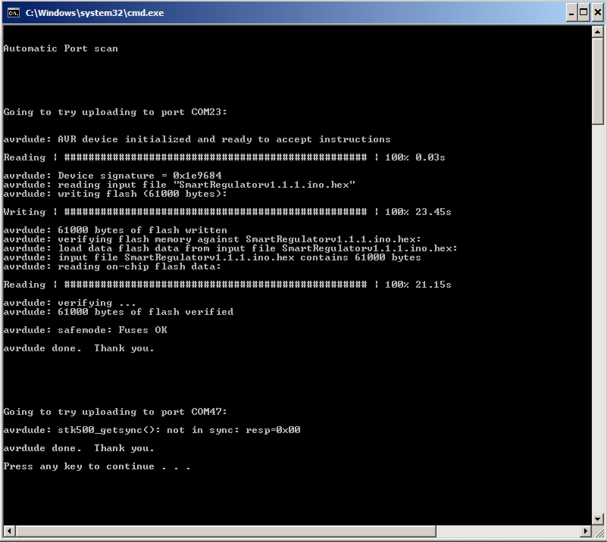

# Firmware Update utility for Alternator Regulator
This repository contains the latest release of firmware for the Alternator Regulator along with a utility to allow for simple and easy updating.
  
*Note:  This utility will only work with the 3rd Generation of the Alternator Regulator.  To update prior generators, refer to the Reference Guide.*
 
## What you need
- PC or laptop running Windows
- USB cable
- Downloaded copy of this utility on your local machine.

Hint:  Be careful with LONG USB cables, anything longer then 1M (3') likely will need an active extension cable.

  
## How to use
- Download this utility as a zip file to your local machine by clicking the green `Clone or download' button on the upper right-hand side.  Save the file as a .ZIP file to your local machine.
- Open up the .zip file and copy the folder `Alt-Update`  to a working directory on your local machine.
- If this is the first time for using this utility you need to install the transfer tool `avrdude`.  Click on `WinAVR-20100110-install`(included in download) to install the tool.
- Connect your regulator to the PC using a USB cable.  Wait for any needed 'drivers' to automatically install.
- If you have more than one regulator to update you may do them independently, or attach both to your computer at the same time.
- Click on `Alt-Update.bat` to initiate the update.

The utility will scan your computer looking for a attached devices.  When it locates an attached device it will verify if it is an Alternator Regulator and attempt to upload the new firmware.  You will be able to see the progress of these scans and the uploads on the screen.  Once the upload is competed you should see the LED start to blink Green slowly as the Alternator Regulator goes through its start up routine.   The following is an example:

In this screen shot you will note that the utility found an Alternator Regulator attached to port COM23: and successfully uploaded the latest firmware.  Make sure to verify there were no errors reported by avrdude while uploading.  The utility also found something other than a regulator attached to COM47:, and though the utility attempted an upload there - it was not successful. (reporting a sync error).   You might want to temporarily unplug anything which is not an Alternator Regulator before running this simple utility.  And if you have connected more than one Alternator Regulator to your computer, the utility will scan and update all of them.

If all is well `press any key' as prompted to exit the utility and unplug your USB cable(s).  If you note any error, rerun the utility.  If error persist, send question to mailing list.

